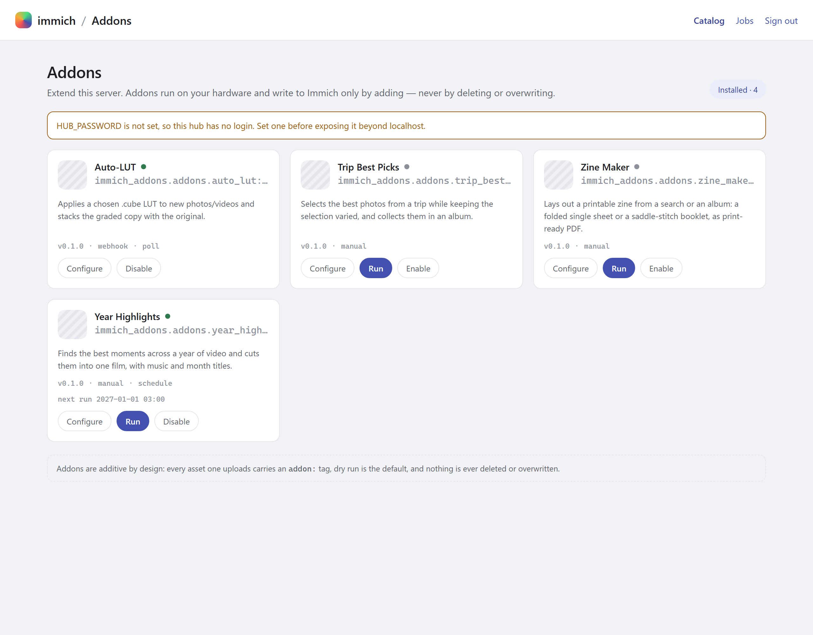
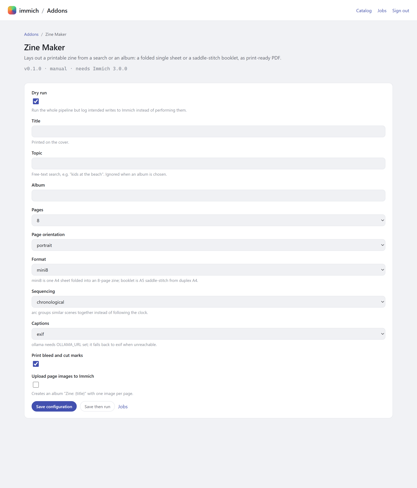
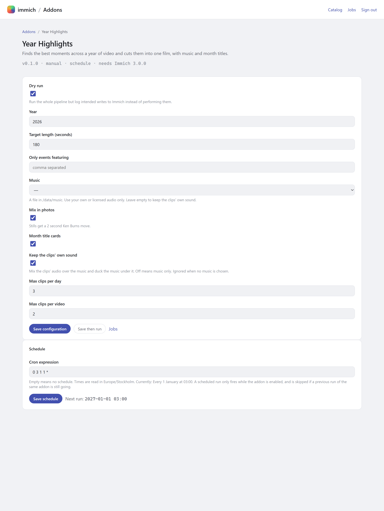

# immich-addons

A self-hosted addon store for [Immich](https://immich.app). One container (the *hub*) runs beside
your Immich server, presents a catalog of addons with per-addon config forms and a job queue, and
does all of its work through Immich's REST API — additively, never destructively.



First-party addons:

| Addon | What it does |
| --- | --- |
| `auto-lut` | Applies a `.cube` LUT to new photos/videos, stacked with the original. |
| `trip-best-picks` | Picks the best *and most varied* photos from a trip into an album. |
| `zine-maker` | Lays out a printable zine (single-sheet mini8 or saddle-stitch booklet) as PDF. |
| `year-highlights` | Cuts a year of video into a music-backed highlight film. |

## Why it is safe to point at a real library

This runs against an irreplaceable family photo library, so the safety rules are structural rather
than aspirational:

- **Additive only.** The Immich client can issue `GET`, `POST` and `PUT` and nothing else — any
  other verb raises before a request is built, and a test asserts no delete path is reachable.
  Originals are never modified.
- **Read-only database.** The Postgres credentials are a read-only role, and the reader refuses to
  execute anything but `SELECT`.
- **Dry run by default.** Every addon starts with `dry_run: true`: the full pipeline runs and the
  intended writes are logged instead of sent.
- **Everything is labelled.** Every asset an addon uploads carries an `addon:<name>` tag, so
  searching that tag lists everything the hub has ever added — and deleting that selection undoes
  it.
- **No feedback loops.** An asset carrying an `addon:*` tag, or matching an addon's own upload
  filename pattern, is skipped before any work happens.

## Configuration is generated, not written

Each addon declares a pydantic model. The form, its validation, the stored JSON and the defaults
all come from that one declaration, so the UI and the code cannot drift apart.



Addons that support it can also run on a schedule — `year-highlights` each 1 January,
`auto-lut` polling when webhooks are not available.



## Run it

```sh
uv sync
cp .env.example .env                # or use a vault — see docs/secrets.md
uv run immich-addons-hub            # http://127.0.0.1:8484
```

In Docker, next to an existing Immich:

```sh
docker compose -f deploy/docker-compose.yml up -d
```

The hub joins Immich's network, keeps its state in `/data`, and binds to loopback unless you widen
`HUB_BIND`. It is meant for a LAN or Tailscale — never the open internet.

Before pointing it at a library you care about, read
**[docs/production.md](docs/production.md)** — the minimal API key, the read-only role, and a
dry-run-first checklist.

> The screenshots above were taken with no `HUB_PASSWORD` set, which is why the catalog shows a
> warning banner. Set one.

## Status

Phases 0–7 are done: the store, all four addons, and the scheduler. Phase 8 (an inbox endpoint and
a small Immich-side integration) is next. See [PLAN.md](PLAN.md) for the phase plan and
[CLAUDE.md](CLAUDE.md) for the standing rules.

Acceptance checks that need real hardware — a full run against the dev Immich, timing on the NAS,
and folding a printed zine — are tracked in the PLAN and are not claimed here.

## Development

```sh
uv run ruff check .     # lint
uv run ruff format .    # format
uv run pytest           # tests — none of them touch a network or a database
```

Full setup, including the throwaway dev Immich and the fixture generator, is in
[docs/development.md](docs/development.md). Secret handling, including
[vaulted](https://github.com/woosal1337/vaulted), is in [docs/secrets.md](docs/secrets.md).

Then check this repo's assumptions against your actual server — endpoint names and the CLIP
embedding table are discovered, never hardcoded from documentation:

```sh
uv run python scripts/probe.py           # version, OpenAPI snapshot, endpoints, key perms, DB
uv run python scripts/probe.py --no-db   # skip the Postgres checks
```

Exit code 0 means every check passed. Rerun it after every Immich upgrade and commit the resulting
snapshot under [`contracts/`](contracts/).

## Licence

MIT — see [LICENSE](LICENSE).
